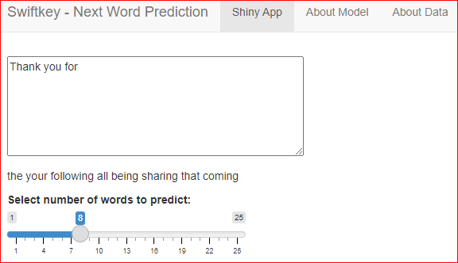

```{r setup, include=FALSE}
knitr::opts_chunk$set(echo = FALSE)
```
  
## Journey of the Shiny Predictor App {#slide1 .emphasized}
  
### This presentation features the following    
  
- Creating n-grams data set used to predict next word in the Shiny App  
- Knowledge capture during the creation of data-set and Shiny App    
- Next Word Prediction - why this specific approach   
  
  
### Links to the app and source code    
- <a target="_blank" href="https://github.com/jayc279/SwiftKey_NLP_Project">Source Code</a>  
- <a target="_blank" href="https://jyanamandala.shinyapps.io/swiftkey_next_word_prediction/">Shiny App</a>
  
  
## Data Wrangling and Tidy Data Set Creation {#slide2 .emphasized}
The raw data contains corpora in 4 different langauages, for this project only en_US locale files were downloaded.  

Text mining was implemented using the **tidy** libraries. Due to huge size of twitter and blog files, used only 33% of their size in this project.  

**Some details about the data:**  

  
## Next Word Prediction Model {#slide3 .emphasized}

The predictive text model was built from a sample of 500k lines extracted from a random sample of a large corpus of blogs, news and twitter data (over 4 million lines).
  
The sample data was tokenized and cleaned with tidytext. Cleaning process included removing profane words, all non-ascii characters, and all words were lower-cased. The strings were then split into tokens (n-grams =4).
  
For the Shiny App, used quadgram (n-gram=4), basically a string of 4 words, datatable with frequencies of occurence to predict next word. 
  
  
## The Shiny App {#app .emphasized}

Users enter text in the text box and the predicted words are posted below the text box  

Users can also select the number of words they want to predict by inputting in the amount of words below the text box.  

<center></center>


## Summary {#future-steps .emphasized}

- Due to machine resource limitations, had to limit reading of blogs.txt, and twitter.txt files to 33% of their respective file sizes
- The Shiny App was built limiting n-grams data set to 500,000 rows 
- Need more data to improve prediction accuracy and effectively suggest words that lead to higher usage by User

### References: 
* [Text Mining with R (Julia Silge & David Robinson](https://www.tidytextmining.com/index.html)  
* [The Life-Changing Magic of Tidying Text | Julia Silge](https://juliasilge.com/blog/life-changing-magic)  

